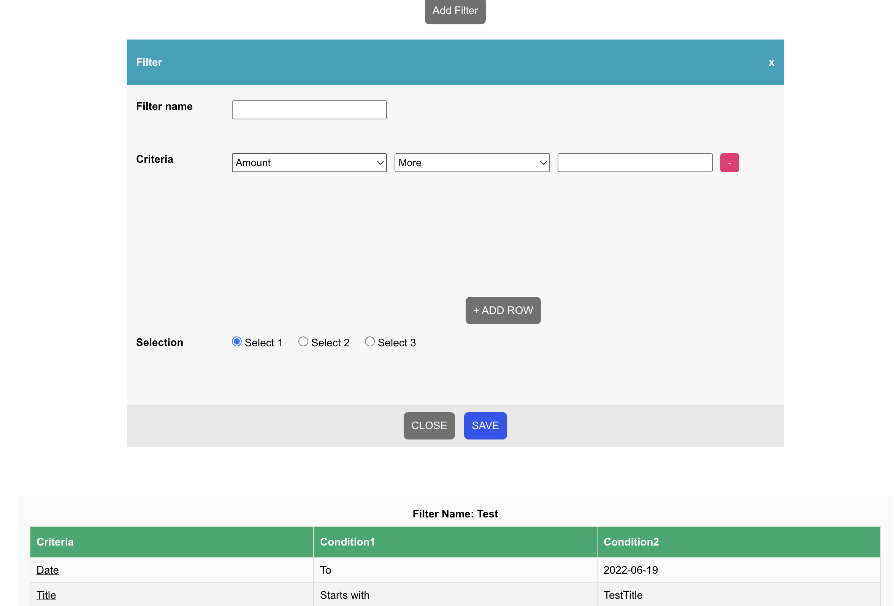

# Filters

## Table of contents

- [Overview](#overview)
  - [The challenge](#the-challenge)
  - [Screenshot](#screenshot)
  - [Links](#links)
  - [Built with](#built-with)
- [Author](#author)

## Overview

### The challenge

Users should be able to:

- View the optimal layout for the site depending on their device's screen size
- Add new criterias
- Remove added criterias
- Create filters
- See all created filters

### Screenshot

### Links

- Solution URL: [https://github.com/Horos20/Filters](https://github.com/Horos20/Filters)
- Live Site URL: [https://horos20.github.io/filters_client/](https://horos20.github.io/filters_client/)

### Built with

- CSS
- [React](https://reactjs.org/) - JS library
- [Nodejs] (https://nodejs.org/en/) - JS runtime 
- [Express] (https://expressjs.com/) - Nodejs framework
- [MongoDB] (https://www.mongodb.com/) - NoSQL database

## Author

- Website - [Matis Rammi](https://matisrammi.com/)